# 🚀 UrlShortener - Microservices Backend & Email System

A high-performance, enterprise-grade **Spring Boot** application designed for scalable URL shortening. This project implements a Microservices architecture pattern, utilizing **Redis** for high-speed caching and rate limiting, **RabbitMQ** for asynchronous decoupling of the email service, and **Docker** for containerized deployment.

The application is fully hosted on **Render** with a CI/CD pipeline integrated via Docker Hub.

---

## 📺 Project Demonstrations
Explore the application in action through these video walkthroughs:

* **Local Environment:** [Testing via Postman & Local Services](https://youtu.be/uP6X6VaUNBs)
* **Hosted Environment:** [Swagger UI & Production Cloud Demo](https://youtu.be/s5jkLdKMoq8)

---

## 📂 Postman Collection & Testing
The repository includes a comprehensive Postman collection to facilitate immediate testing of all API endpoints.

**Location:** `postman/UrlShortener.postman_collection.json`

### How to use the collection:
1.  Navigate to the **postman** folder in the root directory.
2.  Open Postman and click on **Import**.
3.  Drag and drop the `UrlShortener.postman_collection.json` file.
4.  Set up your environment variables (e.g., `baseUrl`) to point to `http://localhost:8080` for local testing.
   
---

## ☁️ Live Deployment & DevOps
The application utilizes a cloud-native approach. The source code is built into a Docker image and deployed to Render.

| **Render Deployment Logs** | **Docker Repository** |
| :--- | :--- |
| 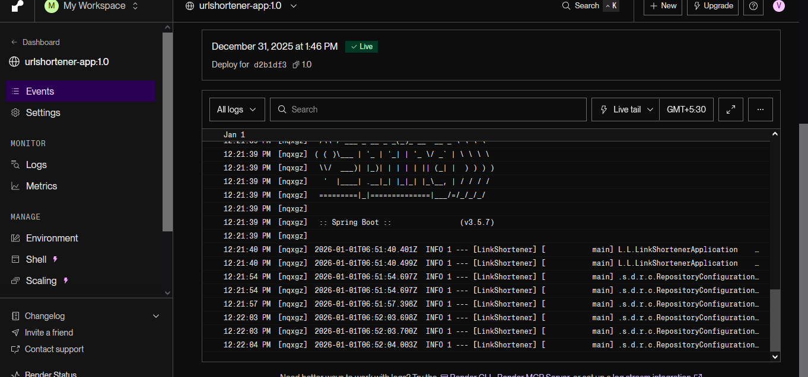 |  |

---

## 📖 API Documentation (Swagger UI)
Interactive documentation is available for the live environment. This allows for real-time testing of endpoints without local setup.

**🔗 Live Link:** [Swagger UI Dashboard](https://urlshortener-app-1-0.onrender.com/swagger-ui/index.html)

## 📑 Table of Contents
1. [Project Overview](#-project-overview)
2. [Visual Walkthrough](#-visual-walkthrough)
    - [Live Deployment](#1-live-deployment--devops)
    - [API Documentation (Swagger)](#2-api-documentation-swagger-ui)
    - [Database & Schema](#3-database--schema-design)
    - [Functional Testing (Postman)](#4-functional-testing-postman)
3. [Architecture & Design](#-architecture--design)
4. [Project Structure](#-project-structure)
5. [Environment Configuration](#-environment-configuration)
6. [Getting Started](#-getting-started)
7. [Troubleshooting](#-troubleshooting)

---

## 💻 Visual Walkthrough

### 1. Live Deployment & DevOps
The application utilizes a cloud-native approach. The source code is built into a Docker image, pushed to Docker Hub, and deployed automatically to Render.

| **Render Deployment Logs** | **Docker Hub Repository** |
| :--- | :--- |
| *Successful build and deploy logs from the cloud hosting provider.* | *Container images stored and versioned in Docker Hub.* |
|  |  |

### 2. API Documentation (Swagger UI)
Interactive documentation is available via Swagger/OpenAPI 3.0. This allows frontend developers and QA engineers to understand the contract without diving into the code.

**Authentication & Admin Controllers:**
Secure endpoints for user registration, login (JWT), and administrator-level user management.

| **Auth Controller** | **Admin & User Management** |
| :--- | :--- |
| 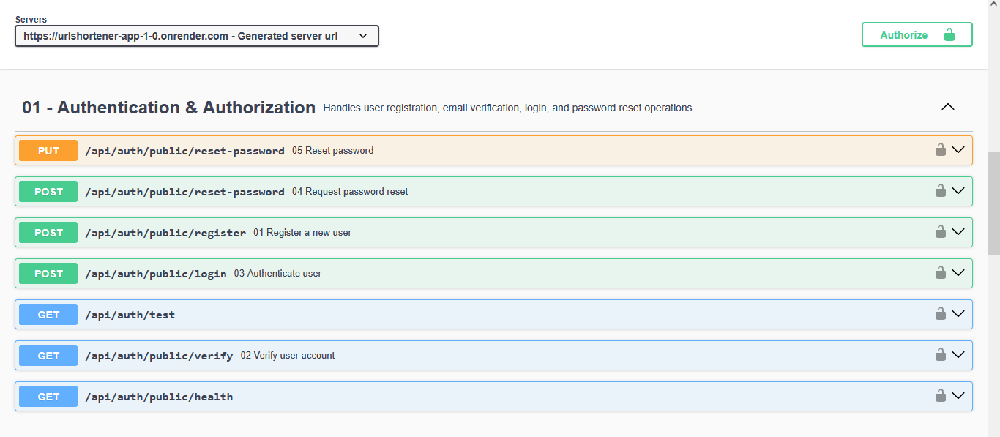 | 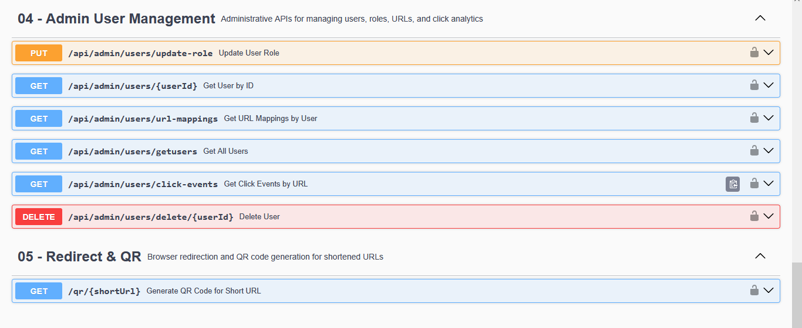 |

**URL Management & DTOs:**
The core business logic handles URL creation, expiration, and redirection. Strictly typed Data Transfer Objects (DTOs) ensure data integrity.

| **URL Management Endpoints** | **Request DTO Models** |
| :--- | :--- |
| 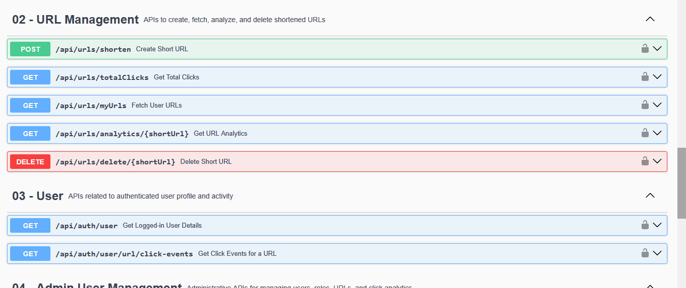 | 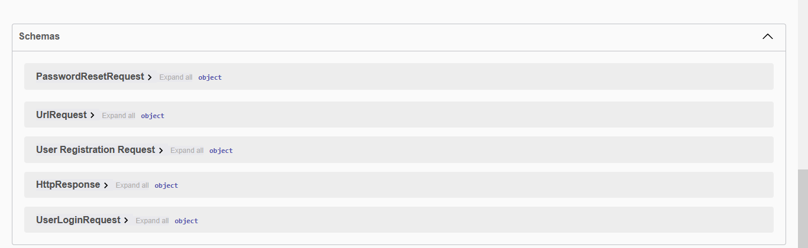 |

### 3. Database & Schema Design
The backend is powered by a relational database (MySQL/PostgreSQL) designed to handle relationships between Users, URLs, and Click Analytics.

| **Database Visualization** | **Live Users Table** |
| :--- | :--- |
| *Visual representation of the data tables.* | *Snapshot of the live database verifying user persistence.* |
| 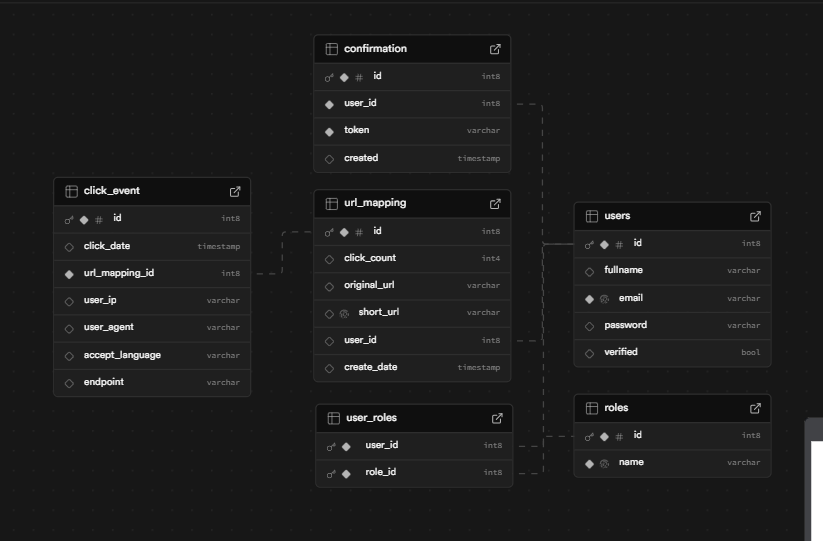 | 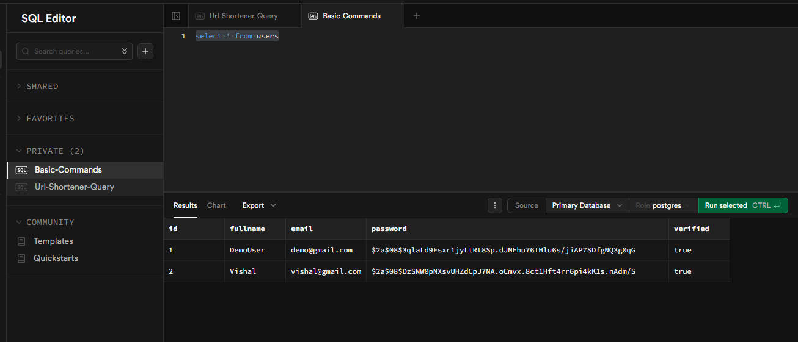 |

### 4. Functional Testing (Postman)
Comprehensive testing was conducted locally to ensure reliability before deployment.

**User Onboarding & Email Flow (RabbitMQ):**
This flow demonstrates the asynchronous nature of the application. The main service sends a message to the RabbitMQ queue, which the Email Service consumes to send a verification code.

| **Step 1: Email Token Received** | **Step 2: Account Verified** | **Step 3: Duplicate Check** |
| :--- | :--- | :--- |
| 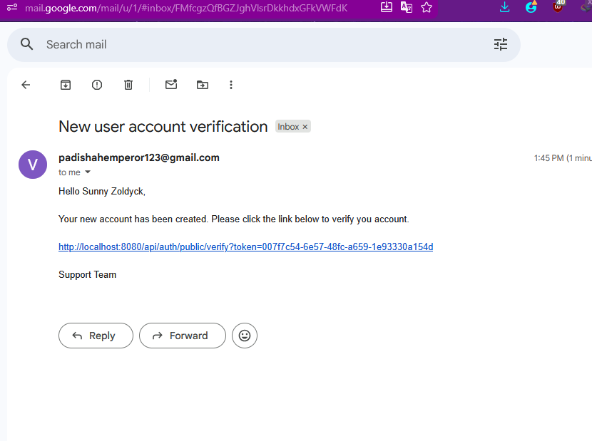 | 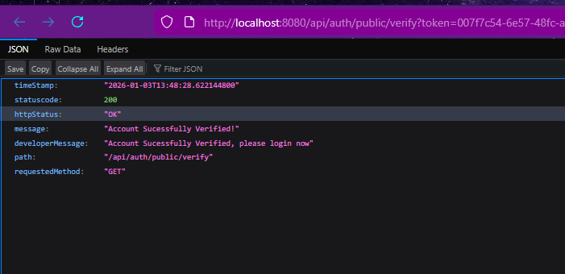 | 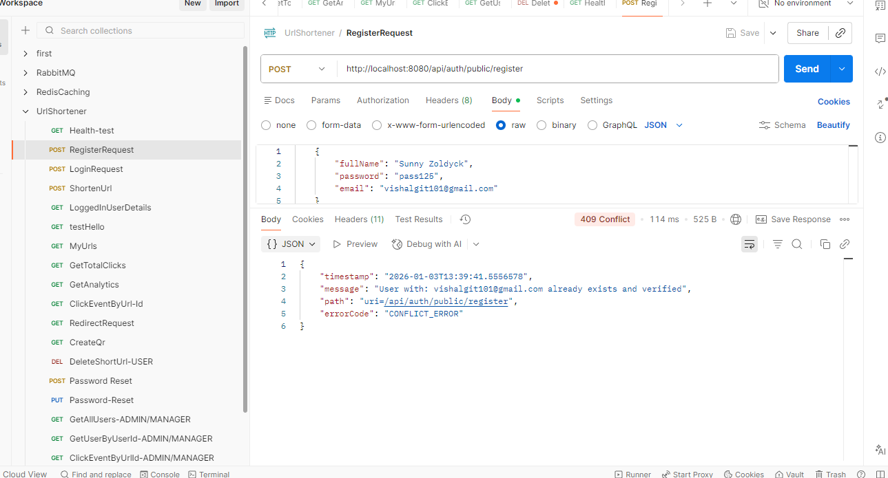 |


Handling asynchronous email messages.
!
!
**RabbitMQ Queues:**
| **RabbitMQ Queues** | **RabbitMQ Cloud** | **Shorten Url** |
| :--- | :--- | :--- |
| 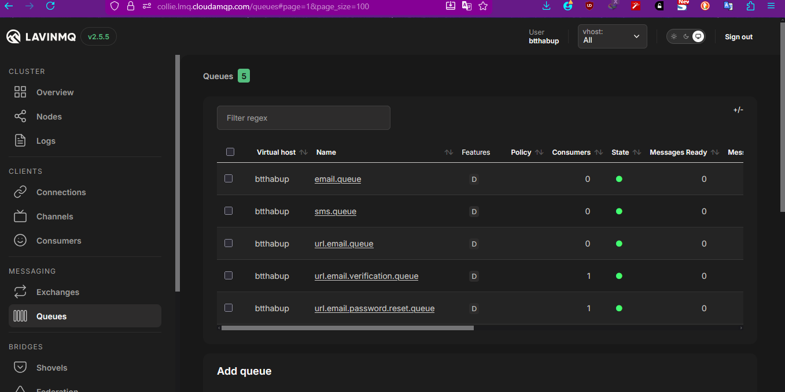 | 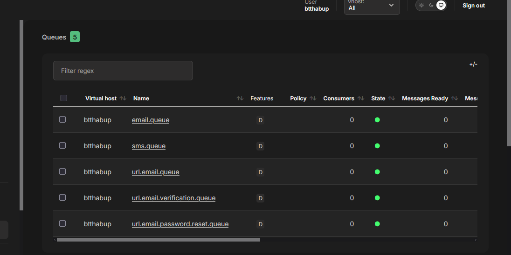| 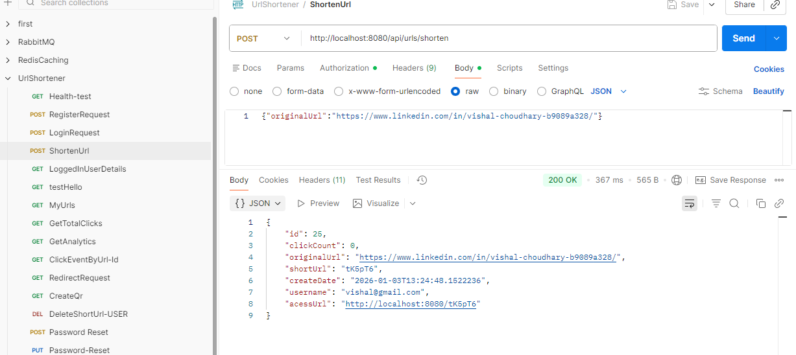 |

**Performance & Analytics:**
Redis is used to cache frequently accessed URLs and limit request rates from specific IP addresses to prevent abuse.

| **QR Code Generation** | **Redis Caching Logs** | **Analytics & IP Tracking** |
| :--- | :--- | :--- |
| 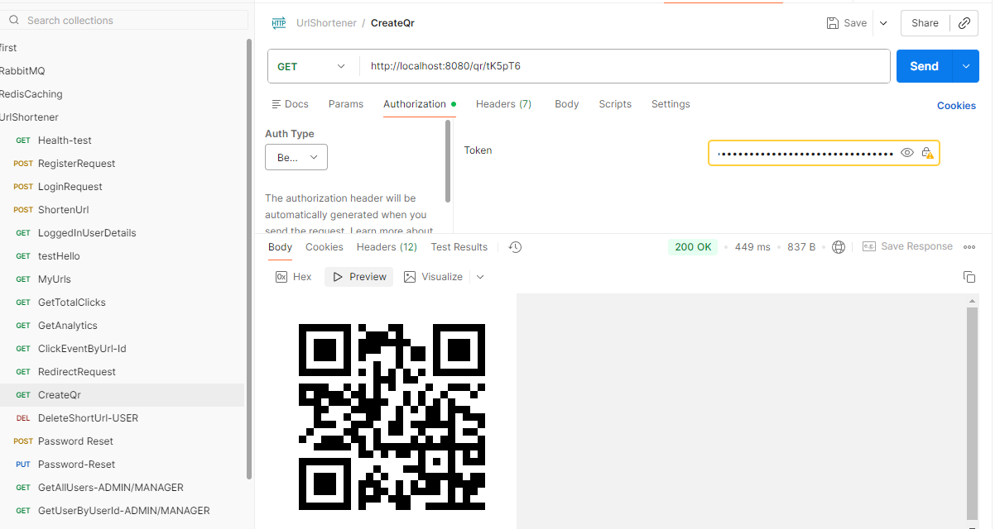 | 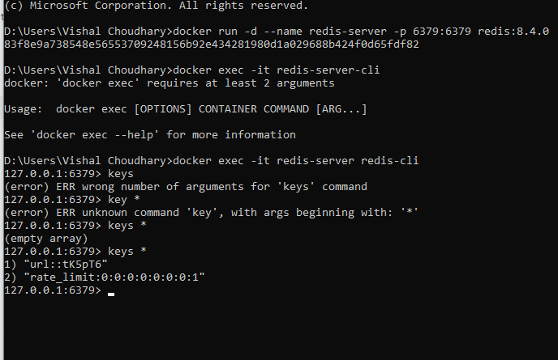 | 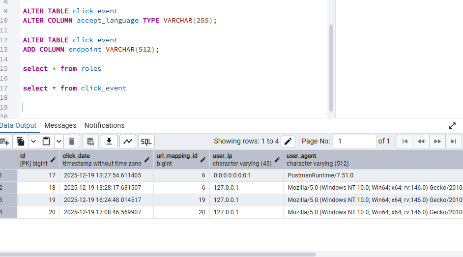 |

---

## 🛠 Project Architecture

The solution uses a **Layered Architecture** to separate concerns:

* **Controller Layer:** Handles incoming REST requests.
* **Service Layer:** Contains business logic (Shortening algorithm, Caching strategy).
* **Repository Layer:** Direct database interaction using JPA.
* **Async Layer:** RabbitMQ Producer/Consumer for email tasks.

**Key Technologies:**
* **Backend:** Java 17, Spring Boot 3.x
* **Database:** MySQL / PostgreSQL
* **Caching:** Redis (Jedis Client)
* **Message Broker:** RabbitMQ
* **Containerization:** Docker
* **Tools:** Lombok, Swagger UI, Maven

---

## 📂 Project Structure

A high-level overview of the source code organization:

```text
com.vishal.urlshortener
├── config              # Configuration classes (Security, Swagger, Redis, CORS)
├── controller          # REST Controllers (AuthController, UrlController)
├── model               # JPA Entities (User, Url, Analytics)
├── dto                 # Data Transfer Objects (LoginRequest, UrlRequest)
├── repository          # Spring Data JPA Interfaces
├── service             # Business Logic (UrlService, EmailService)
├── security            # JWT Authentication filters and logic
├── utils               # Helper classes (CodeGenerator, QRCodeGenerator)
└── UrlShortenerApplication.java  # Main entry point
