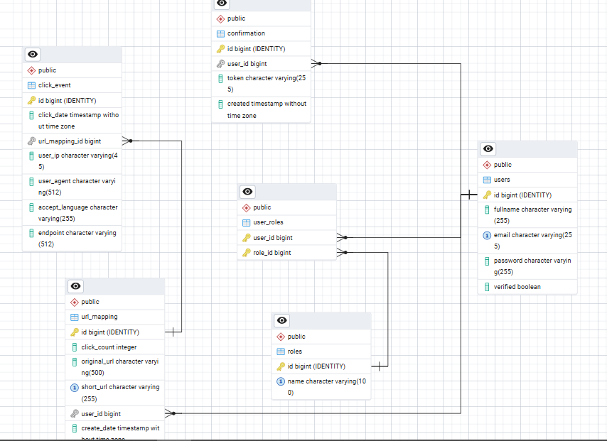
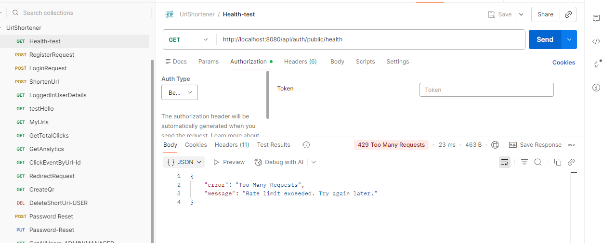
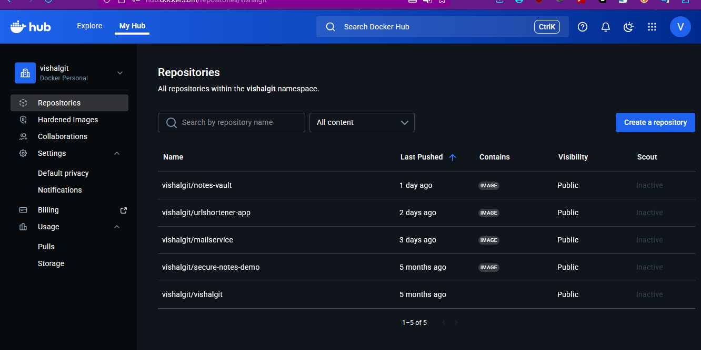
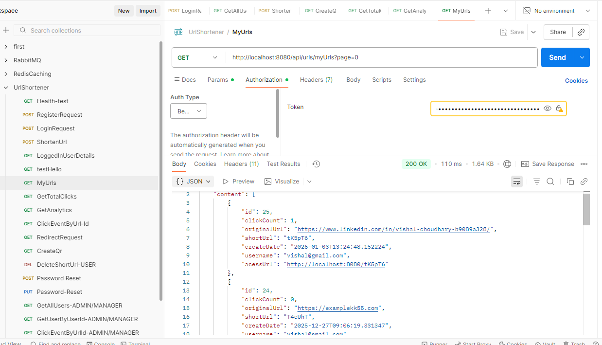
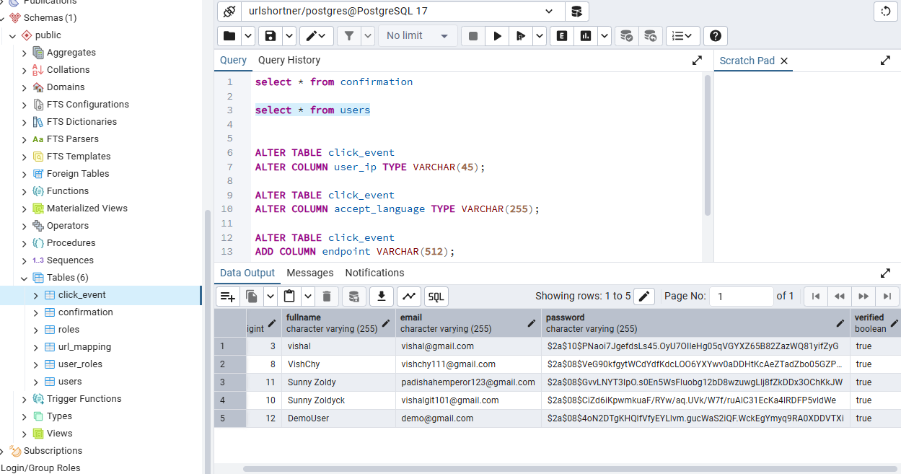

# URL Shortener with Redis Caching, RabbitMQ & Email Microservice

A high-performance, scalable URL Shortener application built with a Microservices architecture. This project features asynchronous email notifications, distributed caching for low latency, rate limiting to prevent abuse, and comprehensive analytics.

## 🚀 Tech Stack

* **Backend:** Java, Spring Boot
* **Database:** SQL (MySQL/PostgreSQL)
* **Caching:** Redis (Key-value store)
* **Message Broker:** RabbitMQ (Asynchronous communication)
* **Containerization:** Docker
* **Testing:** Postman
* **Documentation:** Swagger UI

---

## ✨ Key Features

* **URL Shortening:** Generate short aliases for long URLs.
* **QR Code Generation:** Automatically generate QR codes for shortened links.
* **Rate Limiting:** IP-based rate limiting using Redis to prevent DDoS/spam.
* **Analytics:** Track click events, user IP addresses, and usage statistics.
* **User Management:** Authentication (Login/Register) and Role-based access (Admin/User).
* **Async Email Service:** Email verification and notifications decoupled via RabbitMQ.
* **Docker Support:** Fully containerized application.

---

## 📸 Screenshots & Testing Evidence

The project has been thoroughly tested locally using Postman. Below are screenshots demonstrating the architecture, database design, and successful API responses.

### 1. Architecture & Database Design
**Entity Relationship Diagram (ERD):**
The database schema designed for users, URLs, and analytics.


### 2. Infrastructure (Redis, RabbitMQ & Docker)
**RabbitMQ Queues:**
Handling asynchronous email messages.


**Redis Caching & Rate Limiting:**
Console logs showing cache hits and rate limiting logic.



**Docker Repositories:**


### 3. Core Functionality (Postman Tests)

**User Registration & Verification:**
* **Verification Token via Email:**
    
* **Account Verified:**
    
* **User Already Exists Error:**
    

**URL Operations:**
* **Shortening Service:**
    !https://www.shorturl.at/(screenshots/postman/postman-collection-url-shortener.png)
* **QR Code Creation:**
    
* **My URLs List:**
    

**Analytics:**
* **Click Events & IP Tracking:**
    

### 4. Database Verification
**SQL User Table:**
Snapshot of the database verifying user persistence.


---

## 🛠️ Installation & Setup

### Prerequisites
* Java 17+
* Maven
* Docker & Docker Compose

### Running with Docker (Recommended)
1. Clone the repository:
   ```bash
   git clone [https://github.com/vishalgit101/UrlShortener-RedisCaching-EmailMicroService-RabbitMQ-Backend.git](https://github.com/vishalgit101/UrlShortener-RedisCaching-EmailMicroService-RabbitMQ-Backend.git)
